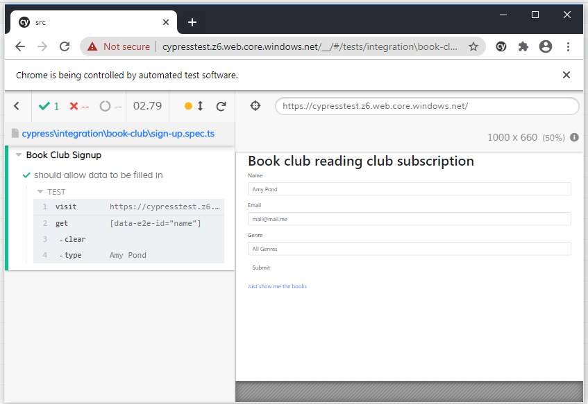
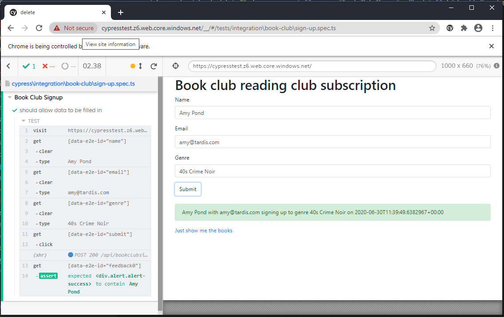

# Our first test - filling in forms

Let's make our first test!

## Setting up our folder structure

We are going to be working with
[this site](https://cypresstest.z6.web.core.windows.net)

If we take a look at the controls on the page we can see the following attached to the `input` controls:

`data-e2e-id="<input name>"`

This is what we are going to use to access the controls on the page.

1. Under the `cypress\integration` folder create this folder: `book-club`

This is where we are going to create our tests for the book club site.

2. In this folder create a file called: `sign-up.spec.ts`

This is the file which will hold the tests that we are going to write for the sign-up page.

## Writing the test

Inside this file we are going to build our first test.

In order to do that we have to let Cypress know that there are tests in the file.

The first thing that we need is to call `Context`

``` ts
context('This is my test context', () => {/*<this is where our test code goes>*/});
```

Inside of this function we are going to define each of our tests. To do this we need to write `it` functions

``` ts
it('should do something`, () => {/* This is our test */});
```

So let's write our actual test!

We are going to:

* Visit the sign-up page
* Fill a name in the field

For this we need two Cypress commands:

* `cy.visit();`
* `cy.get()`

The `visit` command does pretty much what you would expect. It sends the Cypress browser to the URL provided.
The `get` command tries to fetch data from the current DOM in the browser

1. Copy this code into the `sign-up.spec.ts` file

``` ts
context('Book Club Signup', () => {
    it('should allow data to be filled in, submitted and check the response', () => {
        cy.visit('https://cypresstest.z6.web.core.windows.net/')
        cy.get('[data-e2e-id="name"]').clear().type('Amy Pond');
    });
});
```

2. Run Cypress and open the `sign-up.spec.ts` file to see the results. After running our Cypress browser should look like this:



Cypress has navigated to our app, and filled in `Amy Pond` in the name field.

3. Now change the test to fill in the other two fields
4. Add code to click the `Submit` button

`cy.get('[data-e2e-id="submit"]').click();`

5. Check that data we expect to find on the screen after we click `submit` actually appears.

`cy.get('[data-e2e-id="feedback0"]').should('contain', 'Amy Pond')`

And that is our first test! Visit the site, fill in three fields, submit the form and then check we get the correct message on the screen.

Once we save the file, if the Cypress test is still open, we can see that it automatically reruns the test each time we save it.

Now our finished test run should look something like:



The full code to run this test is below:

``` ts
context('Book Club Signup', () => {
    it('should allow data to be filled in, submitted and check the response', () => {
        cy.visit('https://cypresstest.z6.web.core.windows.net/')
        cy.get('[data-e2e-id="name"]').clear().type('Amy Pond');
        cy.get('[data-e2e-id="email"]').clear().type('amy@tardis.com');
        cy.get('[data-e2e-id="genre"]').clear().type('40s Crime Noir');

        cy.get('[data-e2e-id="submit"]').click();
        cy.get('[data-e2e-id="feedback0"]').should('contain', 'Amy Pond')
    });
});
```

## Navigating to a new page

There is one more piece of functionality on this test that we can test. The navigation to the book list.

This test has three steps:

* Go to the sign-up page
* Click the link to the book-list
* Check that we are on the book list page 

1. Add a second `it(...)` to our test file
2. USe `cy.visit(...)` to go to the signup page
3. Click the `Just show me the books` link

`cy.get('[data-e2e-id="link-to-booklist"]').click();`

4. Check the URL of the browser to ensure that we are in the right place

`cy.location('pathname').should('eq', '/book-list');`

When you run Cypress we can now see that both tests are being ran.

Our final test code for this section is as below

``` ts
context('Book Club Signup', () => {
    it('should allow data to be filled in, submitted and check the response', () => {
        cy.visit('https://cypresstest.z6.web.core.windows.net/')
        cy.get('[data-e2e-id="name"]').clear().type('Amy Pond');
        cy.get('[data-e2e-id="email"]').clear().type('amy@tardis.com');
        cy.get('[data-e2e-id="genre"]').clear().type('40s Crime Noir');

        cy.get('[data-e2e-id="submit"]').click();
        cy.get('[data-e2e-id="feedback0"]').should('contain', 'Amy Pond')
    });
    
    it('should navugate to all the books', () => {
        cy.visit('https://cypresstest.z6.web.core.windows.net/')
        cy.get('[data-e2e-id="link-to-booklist"]').click();
        cy.location('pathname').should('eq', '/book-list');
    });
});
```

We've written our first tests, but there are lots of improvements that we can make before we move on to the second. Take a look at [making code reusable](making-code-resuable.md) to go further.
