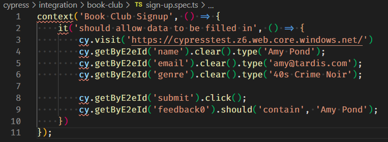
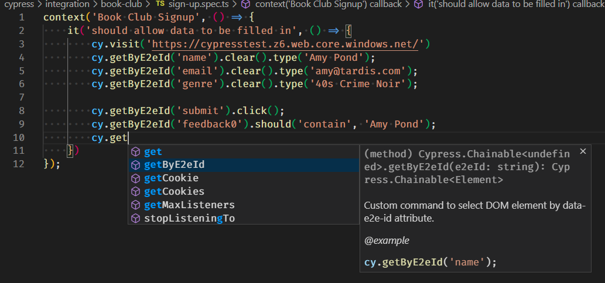
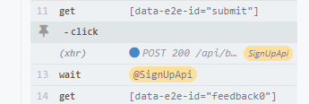

# Making our code reusable

In the [previous section](filling-in-forms-using-cypress.md) we made our first test.

This works fine, and we can use it without a problem. But it's a little verbose, so lets make our lives a little easier when it comes to typing, and reading, our code.

## Adding our first Cypress command

If we look at the repeated code above we see two types of calls that are have lots of repeated text.

* Getting an element from the screen: `get(...)`
* Filling an element returned: `.clear().type(...)`

The `get` call is verbose because the call needs the information about not just what id to look for, but what attribute it should be looking in.

Filling in the input boxes is verbose because we first want to make sure that the input is empty before we fill it.

Cypress has no built in commands to help us make this code easier to write, but it does allow us to expand the base set of commands so that we can tailor it to our own needs!

Let's start with the first step: getting an element from the screen.

We don't want to have to write `[data-e2e-id="<element>'"]` every time we need to access a field, we only want to use the `<element>`. Otherwise it's prone to type errors in the tests should we ever need to change this we'd need to change it for every field in every test. It would be easier for us to encapsulate this in a function where we can just type `getByE2eId("<element>");`

1. In the `cypress\supprt` folder open the `commands.js` file
2. Add this code to the end of the file

``` ts
Cypress.Commands.add("getByE2eId", (e2eId) => {
    const e2eLocator = `[data-e2e-id="${e2eId}"]`
    cy.get(e2eLocator);
});
```

3. Change the test code to use this new function

``` ts
context('Book Club Signup', () => {
    it('should allow data to be filled in, submitted and check the response', () => {
        cy.visit('https://cypresstest.z6.web.core.windows.net/');
        cy.getByE2eId('name').clear().type('Amy Pond');
        cy.getByE2eId('email').clear().type('amy@tardis.com');
        cy.getByE2eId('genre').clear().type('40s Crime Noir');

        cy.getByE2eId('submit').click();
        cy.getByE2eId('feedback0').should('contain', 'Amy Pond');
    });

    it('should navugate to all the books', () => {
        cy.visit('https://cypresstest.z6.web.core.windows.net/');
        cy.getByE2eId('[data-e2e-id="link-to-booklist"]').click();
        cy.location('pathname').should('eq', '/book-list');
    });
});
```

4. Rerun your tests

Everything should still run as it did before, only now the tests are easier to read.

## Making VS Code Intellisense Work

However, in VS Code and other editors with intellisense we now see another problem:



Not only is this distracting, it also means that our editor will no longer help us write our code.

We can solve this by adding an interface definition for the Cypress Chainable class.

1. In the `cypress/support` folder create a file `index.d.ts`
2. Paste this code into that file

``` ts
// in cypress/support/index.d.ts
// load type definitions that come with Cypress module
/// <reference types="cypress" />

declare namespace Cypress {
    interface Chainable {
      /**
       * Custom command to select DOM element by data-e2e-id attribute.
       * @example cy.getByE2eId('name');
      */
      getByE2eId(e2eId: string): Chainable<Element>
    }
  }
```

If we now return to our code we can see that the squiggles have gone and we have full intellisense, including for our new command, available to us. Even with an example!



## Our second command

The next step is to remove the repeated `.clear().type(...)` that we have for every line where we want to enter some text.

There are two ways of solving this:

* Make a command that finds the element, and fills it
* Make a command that chains onto an existing element and fills it

We are going to use the first way, though either approach is valid, and should you need more flexibility the second gives you the ability to fill more than just you own fields.

1. In the `command.js` file add this code

``` ts
Cypress.Commands.add("fillByE2eId", (e2eId, value) => {
    cy.getByE2eId(e2eId).clear().type(value);
});
```

2. Add the command to the `index.d.ts`
3. Use the command in your test file

`index.d.ts`
``` ts
// in cypress/support/index.d.ts
// load type definitions that come with Cypress module
/// <reference types="cypress" />

declare namespace Cypress {
  interface Chainable {
    /**
     * Custom command to select DOM element by data-e2e-id attribute.
     * @example cy.getByE2eId('name');
    */
    getByE2eId(e2eId: string): Chainable<Element>

    /**
     * Custom command to select DOM element by data-e2e-id attribute,
     *  clear the contents and fill with a new value.
     * @example cy.fillByE2eId('name', 'Susan Foreman');
    */
    fillByE2eId(e2eId: string, value: string): Chainable<Element>
  }
}
```

`sign-up.spec.ts`
``` ts
context('Book Club Signup', () => {
    it('should allow data to be filled in, submitted and check the response', () => {
        cy.visit('https://cypresstest.z6.web.core.windows.net/');
        cy.fillByE2eId('name', 'Amy Pond');
        cy.fillByE2eId('email', 'amy@tardis.com');
        cy.fillByE2eId('genre', '40s Crime Noir');

        cy.getByE2eId('submit').click();
        cy.getByE2eId('feedback0').should('contain', 'Amy Pond');
    });

    it('should navugate to all the books', () => {
        cy.visit('https://cypresstest.z6.web.core.windows.net/');
        cy.getByE2eId('[data-e2e-id="link-to-booklist"]').click();
        cy.location('pathname').should('eq', '/book-list');
    });
});
```

## Making our test less flaky

We now have working tests, which are readable and produce the right result. Yes!

There is still a problem though, which we may or may not have seen (and that in itself is part of the problem). This call goes to an API, and then waits for the response. What happens if there is a delay here. A cold start, or just that it takes longer than expected.

There is an easy way to fix this, we can tell Cypress to wait for an amount of time that we think is reasonable, say 10 seconds.

`cy.wait(10000);`

> **Note**: the wait command takes milliseconds as a parameter so we need to pass in 10000 to get 10 seconds.

This would seem to solve our problems, after all the API will probably respond in less than 10 seconds.

But it doesn't guarantee the problem is solved, and it adds a new problem as well.

We are now waiting for 10 seconds, even if the screen is ready to be tested instantly - so our tests are slower now. Much slower.

Worse yet, on a cold start it could take more than 10 seconds to get a reply (OK this is not what we want in an app, but you get the idea) and so the test will still fail.

Thankfully, there is a better option to help us. We can tell Cypress to wait for the API call to finish.

1. At the start of the test, before the `cy.visit` command, add this line to tell Cypress we want to use the cypress server to track API requests.

`cy.server();`

2. Before we click the submit element add this line to tell Cypress to watch for API calls being made to our server. We use the `as` to give the API an alias that allows us to wait in the next step.

`cy.route("POST", 'https://cypresstestapi.azurewebsites.net/api/bookclubsignup').as('SignUpApi');`

3. Before the check for the feedback add this line of code.

`cy.wait('@SignUpApi');`

When you rerun your code you should now the wait appearing in the flow on the left hand side of the screen



Here we see that the API call has been recognised, and the wait to ensure that it is finished.

Now the test will wait until the call finished before moving on. If it happens instantly then there is no delay in our test, if there is a delay we only wait as long as is needed.

Our test file should now look like

``` ts
context('Book Club Signup', () => {
    it('should allow data to be filled in, submitted and check the response', () => {
        cy.server();
        cy.visit('https://cypresstest.z6.web.core.windows.net/');

        cy.fillByE2eId('name', 'Amy Pond');
        cy.fillByE2eId('email', 'amy@tardis.com');
        cy.fillByE2eId('genre', '40s Crime Noir');

        cy.route("POST", 'https://cypresstestapi.azurewebsites.net/api/bookclubsignup').as('SignUpApi');

        cy.getByE2eId('submit').click();
        cy.wait('@SignUpApi')

        cy.getByE2eId('feedback0').should('contain', 'Amy Pond');
    });

    it('should navugate to all the books', () => {
        cy.visit('https://cypresstest.z6.web.core.windows.net/');
        cy.getByE2eId('[data-e2e-id="link-to-booklist"]').click();
        cy.location('pathname').should('eq', '/book-list');
    });
});
```

### Moving Set-up Code Out of Our Test

There is only one more thing that we need to do to these tests, and that is move the set up for the tests out of the tests themselves and into a `before` section.

A before section is called by Cypress before the test, and allows up to set up the application as we want it.

There are two variants.

* before: called once per file
* beforeEach: called before each `it`

Before is only called once, before the first it. Before each is ran before each it.

1. Create a beforeEach function at the top of the `context` function

``` ts
context('Book Club Signup', () => {
    beforeEach(() => {
    });
    .
    .
});
```

2. Move the `cy.server()` and `cy.visit(...)` commands into this before each

If we rerun our tests we should see the same results as before.

Our final test file should look like:

``` ts
context('Book Club Signup', () => {
    beforeEach(() => {
        cy.server();
        cy.visit('https://cypresstest.z6.web.core.windows.net/');
    });

    it('should allow data to be filled in, submitted and check the response', () => {
        cy.fillByE2eId('name', 'Amy Pond');
        cy.fillByE2eId('email', 'amy@tardis.com');
        cy.fillByE2eId('genre', '40s Crime Noir');

        cy.route("POST", 'https://cypresstestapi.azurewebsites.net/api/bookclubsignup').as('SignUpApi');

        cy.getByE2eId('submit').click();
        cy.wait('@SignUpApi')

        cy.getByE2eId('feedback0').should('contain', 'Amy Pond');
    });

    it('should navugate to all the books', () => {
        cy.getByE2eId('[data-e2e-id="link-to-booklist"]').click();
        cy.location('pathname').should('eq', '/book-list');
    });
});
```

> Note: there are many more optimisations that we could, and indeed should, make to this page. But for the purpose of this tutorial we will leave it here.
