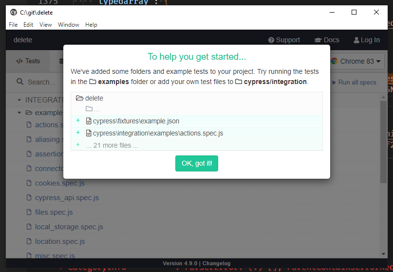
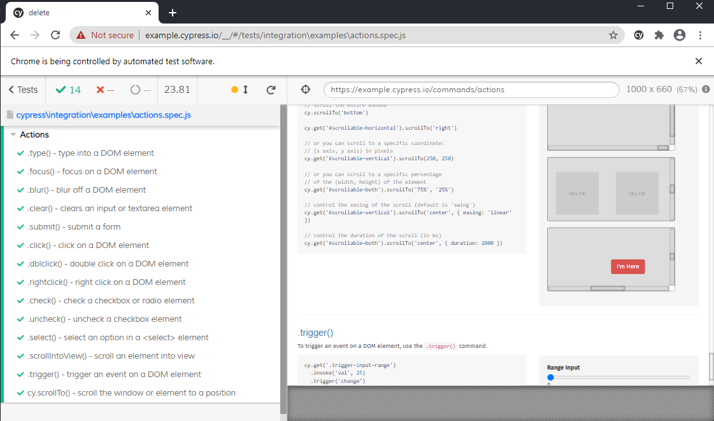
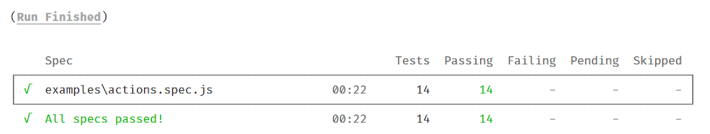

# Running Cypress

Before we get started, the first thing that we need to do is install Cypress on our machine.

## Installing Cypress

As long as you have Node.js installed on your machine running cypress is straightforward.

1. Open a command prompt or Powershell window (from now on called te **terminal** window)
2. Create a new folder on your machine

> **Note**: For ease of clean up I use `C:\Temp\Cypress\Sandbox` for experimenting

3. In this folder run `npm install cypress --save-dev`
4. In order to use Typescript as our development language we also need to run `npm install typescript --save-dev`

These commands should create a `package-lock.json` file and a `node_modules` folder.

The first time you run this command it will also install the full cypress application in your user profile. For windows this is: `C:\Users\<username>\AppData\Local\Cypress\Cache\4.9.0\Cypress`

> **Note**: This process can take some time, but don't worry it only happens the first time we install. If anything fails with your installation you can also remove this folder in order to make a fresh install.

## First Run

Now we can run Cypress for the first time!

1. In your terminal window type `./node_modules/.bin/cypress open`

As this is the first time we are opening Cypress it will create a folder structure for us with some sample tests. The user interface will also give you a guide



The great thing about this is that we can now run Cypress to see what it does!

2. Click the `OK, got it!` button


3. Click the `actions.spec.js` link to run our first tests

We see a Cypress controlled browser window open, and all of the tests in the `spec` file are ran. When all tests have ran we see the screen below.



Congratulations! That's all that we need to do to set-up Cypress and run it!

These example files all run against a test site that Cypress has set up, so that we can get an idea about how tests are organised, and how to call interact with web applications through using the Cypress application.

Feel free to look through the spec files to get an idea of how Cypress works

## Setting Up Npm To Run Cypress

We can now run Cypress, but that command line (`./node_modules/.bin/cypress open`) is a little convoluted and hard to remember 😀

We can use npm can make our life easier here.

As long as the version of npm installed is greater than 5.2.0 we can use npx to run Cypress

`npx cypress open`

This command opens the Cypress application in interactive mode for us.

`npx cypress run`

This command opens Cypress in headless mode for us. But if we try this we can see that there are a lot of example files that it will run. Press `ctrl` + `c` to cancel the process.

Let's run it one more time, but this time limit the run to one spec, the same actions spec that we ran in the interactive application.

`npx cypress run --spec cypress/integration/examples/actions.spec.js`

In the terminal window we can see the tests being ran (along with information on the time they took to run and if they were successful), and the summary of the tests in a table underneath.



The other way that we can use npm to help  us is to set up a `package.json` file to make npm do the heavy lifting for us.

1. In the folder as the `package-lock.json` create a file called `package.json`
2. In that file paste this code snippet:

``` json
{
    "scripts": {
        "cypress": "./node_modules/.bin/cypress open",
        "cypress-run": "./node_modules/.bin/cypress run",
        "cypress-run-a": "./node_modules/.bin/cypress run --spec cypress/integration/examples/a*.spec.js"
    }
}
```

3. Save the file

This gives us access to 3 commands for Cypress

* `npm run cypress` for the interactive application
* `npm run cypress-run` for the headless version
* `npm run cypress-run-a` to run a selection of spec files headless

The last command will run Cypress, headless, for all spec.js files in the examples folder starting with `a`. Much easier than using the --spec flag each time if there groups of spec files that we need to run often.

Using these commands introduces a new problem for us though. The `-- spec` flag no longer works for the `cypress` and `cypress-run` commands! Because npm thinks that the flag is meant for it, and doesn't pass it through. We can fix this though by changing the way that we use the flags.

By using 
an extra `--` we specify that we want to pass the flags through to the underlying command.

1. Run `npm run cypress-run -- --spec cypress/integration/examples/actions.spec.js`

Ok, now that we can install and run Cypress let's see how we can build our first test!
