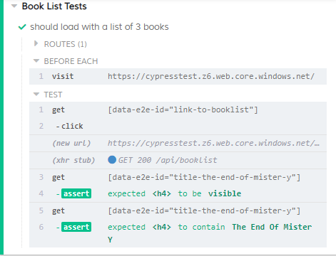
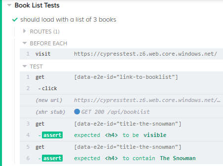
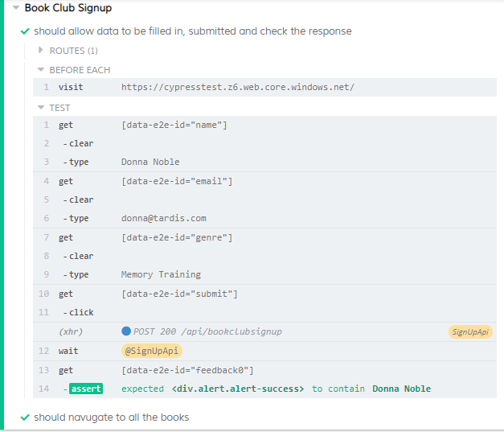

# Introducing fixtures

But that is still a lot of json in our code making it harder to read, and this is only a simple object!

## Add the fixture file

Let's move it somewhere more appropriate

1. In the `cypress/fixtures` folder add a directory `book-club`
2. In the `book-club` folder add a file `book-list.json`
3. Add this json to the `book-list.json` file

``` json
[
    {
        "title": "The End Of Mister Y",
        "author": "Scarlet Thomas",
        "genre": "Fantasy"
    },
    {
        "title": "Deja Dead",
        "author": "Kathy Reichs",
        "genre": "Crime"
    },
    {
        "title": "The Snowman",
        "author": "RL Stein",
        "genre": "Teen Horror"
    }
]
```

This will be our list of books for our test

## Use the fixture file for our API

1. In the `beforeEach(...)` function add:

`cy.fixture('book-club/book-list.json').as('bookList')`

2. Remove the `bookListResponse` constant
3. Change the `cy.route()` to use the fixture defined above

`cy.route(bookListApi, '@bookList');`

4. Re-run the tests

We now see the list of books specified in the `book-list.json` fixture on screen!

## Using the fixture file to make tests more resiliant

But we can do more with this fixture!

in our test we have hard coded our e2e id for the title. But if we change our fixture data then this will break. Let's use the fixture to define the tag for us as well.

1. After the `const bookListApi...` line add:

`const book = this.bookList[0];`

2. Change the `titleE2eId` constant line to:

``` ts
const titleE2eId = `title-${book.title.toLowerCase().split(' ').join('-')}`;
```

> This code looks a little complex, but don't worry about the javascript for now.

3. Change the check for the book title to:

`cy.getByE2eId(titleE2eId).should('contain', book.title);`

4. Rerun your tests

The test has still ran, only now it is using the first book in the list to specify our checks.

But, the test runner isn't reporting about an abstract idea of a book making it hard to follow, it is still reporting to us exactly what it is looking for:



The benefit here is that we can change our test case with ease now - all we are converting the book title into our e2e id format.

1. Change the `const book...` to look for the last book in the list:

`const book = this.bookList[this.bookList.length -1];`

2. Re-run your tests

It still runs! Even though we are now looking for a different book!



## Using fixtures for filling in forms

The last thing that we are going to do with fixtures is use them specify the data that we used in the first test to fill in the form.

1. In the `cypress\fixtures\book-club` folder add a new file `donna-noble.json`
2. Add this json object to the file:

``` json
{
    "name": "Donna Noble",
    "email": "donna@tardis.com",
    "genre": "Memory Training"
}
```

3. Open the `cypress\integration\book-club\sign-up.spec.ts` file
4. Add a fixture in the beforeEach for to get the data from the fixture

`cy.fixture('book-club/donna-noble.json').as('person')`

5. Use this data to fill in the fill, and for the checks at the end of the test

``` ts
cy.fillByE2eId('name', this.person.name);
cy.fillByE2eId('email', this.person.email);
cy.fillByE2eId('genre', this.person.genre);
.
.
.
cy.getByE2eId('feedback0').should('contain', this.person.name);
```
6. Re-run the tests

We now see that the tests have ran, not as `Amy Pond`, but `Donna Noble` from the fixture file, and we have no hard coded test data left in the file.



Full test file using fixture:

``` ts
context('Book Club Signup', () => {
    beforeEach(() => {
        cy.server();
        cy.visit('https://cypresstest.z6.web.core.windows.net/')
        cy.fixture('book-club/donna-noble.json').as('person')
    });

    it('should allow data to be filled in, submitted and check the response', function () {
        cy.fillByE2eId('name', this.person.name);
        cy.fillByE2eId('email', this.person.email);
        cy.fillByE2eId('genre', this.person.genre);

        cy.route("POST", 'https://cypresstestapi.azurewebsites.net/api/bookclubsignup').as('SignUpApi');

        cy.getByE2eId('submit').click();
        cy.wait('@SignUpApi')

        cy.getByE2eId('feedback0').should('contain', this.person.name);
    })

    it('should navugate to all the books', () => {
        cy.getByE2eId('link-to-booklist').click();
        cy.location('pathname').should('eq', '/book-list');
    });
});
```
